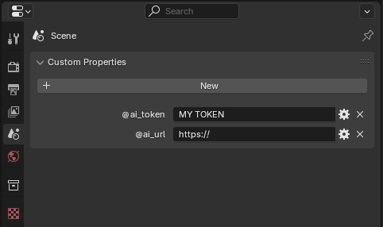

# BTT to AI

[Home](/btt-ai/) |
[Add-on](/btt-ai/addon) |
[Server](/btt-ai/server) |
[Support](https://github.com/moixllik/btt-ai/issues)

## Add-on for Blender


[Download](https://github.com/moixllik/btt-ai/releases/tag/latest)

## Scene / Custom Properties



```conf
Scene['@ai_url'] = [default] http://localhost:8080
Scene['@ai_token'] = [default] None
```

## Strip / Custom Properties

```conf
Strip['ai_query'] = [default] None # ?lang=en
Strip['ai_text'] = [Default] None # Alternative text to generate image
```
